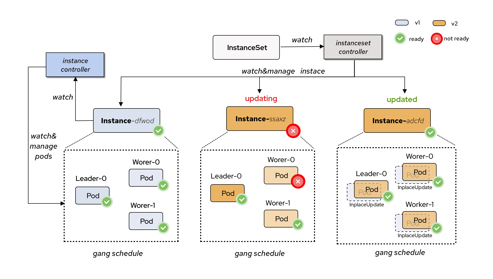

# KEP-30 InstanceSet 
<!--
This is the title of your KEP. Keep it short, simple, and descriptive. A good
title can help communicate what the KEP is and should be considered as part of
any review.
-->

<!--
A table of contents is helpful for quickly jumping to sections of a KEP and for
highlighting any additional information provided beyond the standard KEP
template.

Ensure the TOC is wrapped with
  <code>&lt;!-- toc --&rt;&lt;!-- /toc --&rt;</code>
tags, and then generate with `hack/update-toc.sh`.
-->

<!-- toc -->
- [Motivation](#motivation)
- [Goals](#goals)
- [Proposal](#proposal)
    - [User Stories](#user-stories)
        - [Story 1](#story-1)
        - [Story 2](#story-2)
    - [Risks and Mitigations](#risks-and-mitigations)
- [Design Details](#design-details)
    - [Implementation](#implementation)
    - [Test Plan](#test-plan)
        - [Unit Tests](#unit-tests)
        - [Integration tests](#integration-tests)
        - [End to End Tests](#end-to-end-tests)
- [Related Works](#related-works)
<!-- /toc -->

## Motivation

<!--
This section is for explicitly listing the motivation, goals, and non-goals of
this KEP.  Describe why the change is important and the benefits to users. The
motivation section can optionally provide links to [experience reports] to
demonstrate the interest in a KEP within the wider Kubernetes community.

[experience reports]: https://github.com/golang/go/wiki/ExperienceReports
-->

RBG‘s current Pod orchestration relies on multiple external workload types such as Deployment, StatefulSet, and LeaderWorkerSet (LWS). This dependency limits RBG’s future capabilities to the evolution of other communities. Moreover, the variety of workload options increases the cognitive burden for end users who are not deeply familiar with the Kubernetes ecosystem.

Therefore, we hope the RBG community can offer a set of best practices tailored to large-model inference scenarios. This would allow users to focus more on their applications, while enabling RBG to deliver richer capabilities and a better overall experience.

## Goals

### Introduce a new workload type — `InstanceSet`  
- Orchestrating both single-node and multi-node inference instances.  
- Uses **Instance** (instead of Pod) as the minimal orchestration unit.  
- Provides more configurable fields than LWS, allowing greater flexibility and supporting different upgrade scenarios.  

### Introduce the `Instance` concept and abstraction  
- An *Instance* consists of one or more Pods and represents a logical “distributed instance”.  
- An *Instance* can have differentiated templates and replica configurations.  
- All Pods in an *Instance* can share a synchronized lifecycle — supporting simultaneous traffic drain, start, and stop.  
- All Pods in an *Instance* can support **topology affinity**, **gang scheduling**.  
- An Instance supports **in-place Pod upgrades**, allowing container restarts to reuse locally model parameters or kvcache data (on disk or in memory), greatly improving startup speed and state reuse.

## Proposal

### User Stories

<!--
Detail the things that people will be able to do if this KEP is implemented.
Include as much detail as possible so that people can understand the "how" of
the system. The goal here is to make this feel real for users without getting
bogged down.
-->

#### Story 1
> In-Place Update

Model parameters or KVCache is downloaded/offload into a **Memory-based EmptyDir** volume. 

When upgrading an Instance, the **Pod sandbox** should remain unchanged; only the container corresponding to the updated image should be recreated, preserving data in the **EmptyDir** volume.

After upgrading the container image, the Pod can reuse these cached data in **EmptyDir** to accelerate startup or inference. Additionally, the Pod should not need to be rescheduled, which reduces the probability of entering a **Pending** state.


#### Story 2
> Rolling Update with MaxSurge

In certain high-stability scenarios, the upgrade process should be as smooth as possible. For example, by using a `MaxSurge > 1` strategy, InstanceSet can first scale up a portion of *Instances*. Once these new-version *Instances* become available, InstanceSet then scale down the old-version *Instances*. This ensures that the number of available *Instances* never decreases during the upgrade.


### Risks and Mitigations

<!--
What are the risks of this proposal, and how do we mitigate? Think broadly.
For example, consider both security and how this will impact the larger
Kubernetes ecosystem.

How will security be reviewed, and by whom?

How will UX be reviewed, and by whom?

Consider including folks who also work outside the SIG or subproject.
-->
- The *RBG + InstanceSet* mode only supports newly created RBG objects.  
- Existing RBGs cannot be directly switched to use InstanceSet as the underlying workload type.

## Design Details

The overall desgin of `InstanceSet`. 



<!--
This section should contain enough information that the specifics of your
change are understandable. This may include API specs (though not always
required) or even code snippets. If there's any ambiguity about HOW your
proposal will be implemented, this is the place to discuss them.
-->
### InstanceSet API

```yaml
apiVersion: workloads.x-k8s.io/v1alpha1
kind: InstanceSet
metadata:
  name: deepseek-r1-ep32
  generation: 2
spec:
  replicas: 10  ## 3 Instances
  updateStrategy:
    maxUnavailable: 10% 
    maxSurge: 0
    partition: 90% ## only 10% Pod will be upgraded to new-version
    type: ReCreate | InPlaceIfPossible
  selector:
    llm: deepseek-r1-ep32
  instanceTemplate:
    podUpgradePolicy: Recreate | InplaceIfPossible
    // +optional
    restartPolicy: RecreateRoleInstanceOnPodRestart | RestartRoleInstanceOnPodRestart | None
    // +optional
    readyPolicy: InstanceReadyOnAllPodReady | None
    // +optional
    podGroupPolicy:
      kubeScheduling:
        timeoutSeconds: 30
    // +optional
    readinessGates:
      - conditionType: InPlaceUpdateReady
    components:
    - name: leader
      size: 1
      serviceName: deepseek-r1-master
      template:
        metadata:
          labels:
            llm: deepseek-r1-ep32
        spec:
          conatiners:
          - name: llmservice
            image: vllm/deepseek:r1
            command: ["/run.sh", "--master"]
    - name: worker
      size: 2
      serviceName: deepseek-r1-slave
      template:
        metadata:
          labels:
            llm: deepseek-r1-ep32
        spec:
          conatiners:
          - name: llmservice
            image: vllm/deepseek:r1
            command: ["/run.sh", "--slave"]
status:
  replicas: 10
  readyReplicas: 10
  availableReplicas: 10
  updatedReplicas: 1
  updatedReadyReplicas: 1
  currentRevision: deepseek-r1-ep32-asdfasdfsd 
  updateRevision: deepseek-r1-ep32-sdfdsgfs21
  labelSelector: llm=deepseek-r1-ep32 
  observedGeneration: 2
```
#### Field Descriptions

- `spec.updateStrategy`: 
Defines the **Instance-level** upgrade strategy.  
The behavior is generally aligned with OpenKruise CloneSet.

- `spec.instanceTemplate`:
Define the templates and policies for the **Pods within a single Instance**.
  - `components`:
    Specifies the **differentiated templates** for pods within the Instance (e.g., leader & worker template).
  - `restartPolicy`:
    Specifies the **restart behavior** at the Instance level:  
    - **`RecreateRoleInstanceOnPodRestart`**: If any Pod within the Instance restarts, the entire Instance is recreated.  
      *(Both Instance and Pod names will change.)*
    - **`RestartRoleInstanceOnPodRestart`**: If any Pod within the Instance restarts, all Pods in the Instance will be restarted/recreated.  
      *(Instance and Pod names remain unchanged; in-place restart is also possible here.)*
    - **`None`**: No action taken.
  - `readyPolicy`:
    Specifies the **readiness / traffic acceptance policy** at the Instance level:  
    - **`InstanceReadyOnAllPodReady`**: The Instance and all its Pods are marked `Ready` only when **all** Pods inside the Instance are `Ready`. Otherwise, they are marked `NotReady`.
    - **`None`**: No special handling.
  - `podGroupPolicy`:
Specifies the **Gang scheduling semantics** at the Instance level.  Gang scheduling ensures that either all Pods in the Instance are scheduled together, or none are scheduled, avoiding partial startup scenarios.


### Instance API

An `InstanceSet` will create `Instance` by its `replicas` and `instanceTemplate` specifications.
```yaml
apiVersion: workloads.x-k8s.io/v1alpha1
kind: Instance
metadata:
  name: deepseek-r1-ep32-jsadk
  labels:
    llm: deepseek-r1-ep32
spec:
 components:
 - name: leader
   size: 1
   serviceName: deepseek-r1-master
   template:
     metadata:
       labels:
         llm: deepseek-r1-ep32
         gang.scheduling.k8s.io/group-name: deepseek-r1-ep32-jsadk 
     spec:
       conatiners:
       - name: llmservice
         image: vllm/deepseek:r1
         command: ["/run.sh", "--master"]
- name: worker
   size: 2
   serviceName: deepseek-r1-slave
   template:
     metadata:
       labels:
         llm: deepseek-r1-ep32
         gang.scheduling.k8s.io/group-name: deepseek-r1-ep32-jsadk 
     spec:
       conatiners:
       - name: llmservice
         image: vllm/deepseek:r1
         command: ["/run.sh", "--slave"]
 readinessGates:
 - conditionType: InPlaceUpdateReady
 restartPolicy: RecreateRoleInstanceOnPodRestart | RestartRoleInstanceOnPodRestart | None
 readyPolicy: InstanceReadyOnAllPodReady | None
 podUpgradePolicy: Recreate | InplaceIfPossible
 podGroupPolicy:
   kubeScheduling:
     timeoutSeconds: 30
status:
  conditions:
  - type: Ready
    status: True
  currentRevision: deepseek-r1-jsadk-asdhjkl13
  updateRevision: deepseek-r1-jsadk-asdhjkl13
  componentStatus:
  - class: leader
    replicas: 1
    readyReplicas: 1
    updatedReplicas: 1
  - class: worker
    replicas: 2
    readyReplicas: 2
    updatedReplicas: 2
     
```

#### In-Place Update Supports

**Instance-level Upgrade Behavior**

| Changed Field Scope               | Instance Upgrade Behavior                              |
|-----------------------------------|--------------------------------------------------------|
| `InstanceSet[x].Size`             | **Recreate** — the entire Instance is rebuilt/upgraded |
| Other `Instance`-level fields     | **In-place upgrade**                                   |

> **Rule:** If an Instance is rebuilt (**Recreate**), all Pods within that Instance will also be rebuilt.

**Pod-level Upgrade Behavior**

| Changed Field Scope within Pod Template   | Pod Upgrade Behavior                                                      |
|-------------------------------------------|----------------------------------------------------------------------------|
| `template.metadata` or `container.image`  | **In-place** upgrade for the affected Pods                                |
| Other `template` fields                   | **Recreate** — the affected Pods are rebuilt                              |

> **Rule:** When an Instance is upgraded **in-place**, Pods may or may not be upgraded in-place.  
> The actual Pod behavior depends on which parts of the Pod Template change.  
> For example, metadata/image changes ⇒ in-place Pod upgrade; other changes ⇒ Pod recreate.


### RoleBasedGroup API with InstanceSet

For describing the **InstanceSet** in the **RoleBasedGroup (RBG) API**, several approaches can be considered.

#### Option 1: Expose via Additional Fields

Introduce new fields in the RBG API to directly describe the relevant InstanceSet configurations.

```golang
type RolloutStrategy struct {
	// Type defines the rollout strategy, it can only be “RollingUpdate” for now.
	//
	// +kubebuilder:validation:Enum={RollingUpdate}
	// +kubebuilder:default=RollingUpdate
	Type RolloutStrategyType `json:"type"`

	// PodUpdatePolicy indicates the policy to update pods under the role.
	// Only InstanceSet kind workload supports InPlaceIfPossible policy.
    // +kubebuilder:validation:Enum={Recreate, InPlaceIfPossible}
	// +kubebuilder:default=Recreate
	// +optional
	PodUpdatePolicy *RolloutPodUpdatePolicyType `json:"podUpdatePolicy,omitempty"`

	// RollingUpdate defines the parameters to be used when type is RollingUpdateStrategyType.
	// +optional
	RollingUpdate *RollingUpdate `json:"rollingUpdate,omitempty"`
}

// RoleSpec defines the specification for a role in the group
type RoleSpec struct {
  ... ...
	// RolloutStrategy defines the strategy that will be applied to update replicas
	// when a revision is made to the leaderWorkerTemplate.
	// +optional
	RolloutStrategy *RolloutStrategy `json:"rolloutStrategy,omitempty"`

	// RestartPolicy defines the restart policy when pod failures happen.
	// The default value is RecreateRoleInstanceOnPodRestart for LWS and None for STS & Deploy. Therefore, no default value is set.
	// +kubebuilder:validation:Enum={None,RecreateRBGOnPodRestart,RecreateRoleInstanceOnPodRestart}
	// +optional
	RestartPolicy RestartPolicyType `json:"restartPolicy,omitempty"`

  // ReadyPolicy defines the subGroup/instance ready behavior when pod becoming not ready in an subGroup/instance.
  // defaults None.
  // +kubebuilder:validation:Enum={None, RoleInstanceReadyOnAllPodReady} 
  // +optional
  ReadyPolicy ReadyPolicyType `json: "readyPolicy,omitempty"` 

  // Instance components template
	InstanceComponents []InstanceComponentTemplate `json:"instanceComponents,omitempty"`

  ... ...
}

type InstanceComponentTemplate struct {
  // Name of this compenent
	Name string `json:"name"`

  // Size is the replicas of this component
  // defualts to 1 if not set.
  // +optional
	Size *int32 `json:"size,omitempty"`

  // PatchTemplate and role.Template will merged as final Template
	PatchTemplate runtime.RawExtension `json:"patchTemplate,omitempty"`
}
```


#### Option 2: Expose in a Way Compatible with LWS
Keep the RBG API compatible with the existing **LeaderWorkerSet (LWS)** structure and semantics,  
while internally mapping to **InstanceSet** behavior as needed.  
This approach minimizes changes for users familiar with LWS, potentially lowering the learning curve and migration costs.

```golang
type RolloutStrategy struct {
	// Type defines the rollout strategy, it can only be “RollingUpdate” for now.
	//
	// +kubebuilder:validation:Enum={RollingUpdate}
	// +kubebuilder:default=RollingUpdate
	Type RolloutStrategyType `json:"type"`

	// PodUpdatePolicy indicates the policy to update pods under the role.
	// Only InstanceSet kind workload supports InPlaceIfPossible policy.
    // +kubebuilder:validation:Enum={Recreate, InPlaceIfPossible}
	// +kubebuilder:default=Recreate
	// +optional
	PodUpdatePolicy *RolloutPodUpdatePolicyType `json:"podUpdatePolicy,omitempty"`

	// RollingUpdate defines the parameters to be used when type is RollingUpdateStrategyType.
	// +optional
	RollingUpdate *RollingUpdate `json:"rollingUpdate,omitempty"`
}

// RoleSpec defines the specification for a role in the group
type RoleSpec struct {
  ... ...
	// RolloutStrategy defines the strategy that will be applied to update replicas
	// when a revision is made to the leaderWorkerTemplate.
	// +optional
	RolloutStrategy *RolloutStrategy `json:"rolloutStrategy,omitempty"`

	// RestartPolicy defines the restart policy when pod failures happen.
	// The default value is RecreateRoleInstanceOnPodRestart for LWS and None for STS & Deploy. Therefore, no default value is set.
	// +kubebuilder:validation:Enum={None,RecreateRBGOnPodRestart,RecreateRoleInstanceOnPodRestart}
	// +optional
	RestartPolicy RestartPolicyType `json:"restartPolicy,omitempty"`

  // ReadyPolicy defines the subGroup/instance ready behavior when pod becoming not ready in an subGroup/instance.
  // defaults None.
  // +kubebuilder:validation:Enum={None, RoleInstanceReadyOnAllPodReady} 
  // +optional
  ReadyPolicy ReadyPolicyType `json: "readyPolicy,omitempty"` 

	// LeaderWorkerSet template
  // Using InstanceSet when workload kind is InstanceSet.
	// +optional
	LeaderWorkerSet LeaderWorkerTemplate `json:"leaderWorkerSet,omitempty"`

  ... ...
}
```

<!--
**Note:** *Not required until targeted at a release.*
The goal is to ensure that we don't accept enhancements with inadequate testing.

All code is expected to have adequate tests (eventually with coverage
expectations). Please adhere to the [Kubernetes testing guidelines][testing-guidelines]
when drafting this test plan.

[testing-guidelines]: https://git.k8s.io/community/contributors/devel/sig-testing/testing.md
-->

[X] I/we understand the owners of the involved components may require updates to
existing tests to make this code solid enough prior to committing the changes necessary
to implement this enhancement.

#### Implementation


#### Unit Tests

<!--
In principle every added code should have complete unit test coverage, so providing
the exact set of tests will not bring additional value.
However, if complete unit test coverage is not possible, explain the reason of it
together with explanation why this is acceptable.
-->

<!--
Additionally, try to enumerate the core package you will be touching
to implement this enhancement and provide the current unit coverage for those
in the form of:
- <package>: <date> - <current test coverage>

This can inform certain test coverage improvements that we want to do before
extending the production code to implement this enhancement.
-->

#### Integration tests

<!--
Describe what tests will be added to ensure proper quality of the enhancement.

After the implementation PR is merged, add the names of the tests here.
-->

#### End to End Tests


## Related Works

### Feature Comparison: InstanceSet vs LeaderWorkerSet (LWS)

| Feature                                              | InstanceSet | LWS |
|------------------------------------------------------|-------------|-----------------|
| Pod traffic lifecycle binding within an Instance     | ✅ Yes       | ❌ No            |
| Gang scheduling semantics at Instance granularity    | ✅ Yes       | ❌ No            |
| Support for in-place upgrade / restart               | ✅ Yes       | ❌ No            |
| Allow modifying `Size` and more configuration fields | ✅ Yes       | ❌ No            |
| Support `MaxSurge` upgrade strategy at Instance level       | ✅ Yes       | ❌ No            |


## Alternatives

<!--
What other approaches did you consider, and why did you rule them out? These do
not need to be as detailed as the proposal, but should include enough
information to express the idea and why it was not acceptable.
-->
